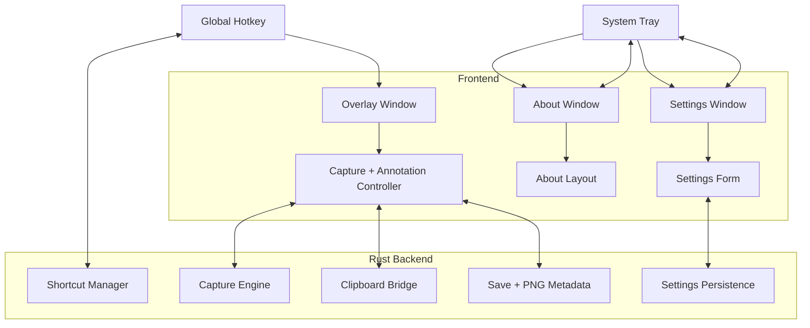

# Project Plan: Screencap

## 1. Project Snapshot

- **Product:** Cross-platform screenshot and annotation desktop application built with Tauri v2, Rust, TypeScript, and Vite.
- **Current version:** `0.1.1`
- **Current status:** Feature-complete for the current Windows desktop MVP, with packaging working and the main focus shifted from scaffolding to polish, verification, and release hardening.
- **Current runtime surfaces:** Hidden Settings window, fullscreen transparent Overlay window, standalone About window/page, and a system tray entry point with hotkey-driven capture flow.

---

## 2. Chat History Summary

### 2.1 Delivery Summary

- Started from the original architecture/spec plan and implemented the Tauri desktop foundation.
- Added Rust backend commands for screen capture, clipboard copy, file save, URL opening, settings persistence, and hotkey management.
- Built the frontend Settings page and capture Overlay page with annotation tools and export flow.
- Added packaging helpers for a constrained local environment, including Node 13 compatibility and Cargo path handling.

### 2.2 Debugging And UX Iterations

- Fixed runtime and lifecycle issues including screen capture fallback behavior, text tool activation bugs, confirm button close behavior, settings reopen after close, tray icon visibility, overlay controls blocking capture interactions, and external GitHub link opening via the OS browser.
- Improved overlay usability with smaller movable floating controls, friendlier arrow rendering, hide-on-success save flow, and compact annotation property controls.

### 2.3 Metadata, Docs, And Productization

- Added shared app metadata for version, credits, release date, and repository URL.
- Centralized version alignment so `package.json` is the version source of truth and syncs to Tauri and Cargo metadata.
- Added PNG save metadata through both PNG `tEXt` metadata and PNG `eXIf` metadata payloads.
- Wrote a complete `README.md` and cleaned up path-specific documentation issues.
- Added a shared About layout, then promoted it into a standalone About page/window opened from the tray.

### 2.4 Validation Summary

- Frontend builds have been repeatedly validated with `npm run build`.
- Backend behavior has been validated with focused Rust tests and `cargo build`.
- Tauri packaging has been validated with `npm run tauri:build` producing MSI and NSIS artifacts.

---

## 3. Current Implemented Scope

### 3.1 Backend

- [x] Tauri v2 application scaffold
- [x] System tray with `Settings`, `About`, and `Quit`
- [x] Global shortcut registration and update flow
- [x] Settings persistence and reset
- [x] Native screen capture flow with Windows fallback support
- [x] Clipboard export
- [x] File save with PNG metadata writing
- [x] External URL opening via backend command
- [x] Main/About window hide-on-close lifecycle behavior

### 3.2 Frontend

- [x] Settings page
- [x] Fullscreen transparent overlay page
- [x] Standalone About page
- [x] Selection rectangle and live dimensions
- [x] Annotation tools: select, rectangle, arrow, text, blur
- [x] Text styling controls: font, background color, border color, border size
- [x] Clipboard export and PNG save flow
- [x] Overlay move/reposition behavior for better capture ergonomics

### 3.3 Packaging And Docs

- [x] Node/Cargo wrapper scripts for local build constraints
- [x] Version synchronization across package, Tauri, and Cargo metadata
- [x] README and release-facing documentation
- [x] MSI and NSIS bundle production

---

## 4. Architecture Status

### 4.1 Current Desktop Structure

### 4.2 Important Implementation Decisions

- Overlay and About windows are created once and reused.
- Main and About windows hide on close instead of being destroyed.
- `package.json` is the version source of truth.
- PNG export metadata is written in Rust at the actual file save path.

---

## 5. Updated Phase Status

### Phase 1: Rust Backend Infrastructure

- [x] Initialize Tauri v2 project
- [x] Implement tray menu and window lifecycle behavior
- [x] Setup global shortcut flow
- [x] Implement screen capture command and fallback behavior
- [x] Implement settings persistence, save/export, and URL opening commands

### Phase 2: Frontend Overlay And Settings UI

- [x] Design and ship fullscreen transparent overlay
- [x] Implement capture rendering and area selection
- [x] Implement keyboard close behavior and interaction state handling
- [x] Build the Settings page and standalone About page

### Phase 3: Annotation Features

- [x] Implement rectangle, arrow, text, and blur tools
- [x] Implement text property configuration
- [x] Implement export-to-clipboard and save-to-file actions
- [x] Implement overlay layout improvements for usability

### Phase 4: OS Integration And Optimization

- [x] Clipboard integration
- [x] Windows capture fallback
- [x] Window reuse and hide/show lifecycle
- [x] Packaging pipeline validation
- [~] macOS permission and runtime validation remains to be verified on-device

### Phase 5: Release Hardening

- [x] Shared metadata and About surface
- [x] Version synchronization
- [x] PNG metadata writing
- [x] README completion
- [ ] Final manual regression pass on packaged build
- [ ] Product readiness sign-off across supported environments

---

## 6. Open Work

### 6.1 High Priority

- [ ] Run a fresh packaged-app regression pass on the latest build after the standalone About page changes.
- [ ] Verify About tray action, settings reopen behavior, capture flow, clipboard copy, save flow, and PNG metadata in the packaged executable.
- [ ] Confirm Windows tray icon, overlay movement, and save-after-hide behavior in final artifacts.

### 6.2 Platform Validation

- [ ] Validate macOS permissions and capture behavior on real hardware.
- [ ] Validate multi-monitor and mixed-DPI behavior with broader manual coverage.

### 6.3 Optional Follow-Up

- [ ] Consider JPG save support if still required by product scope.
- [ ] Consider richer About content or application diagnostics surface.
- [ ] Consider automated artifact smoke checks after package build.

---

## 7. Testing And Verification Status

### Verified Recently

- [x] `npm run build`
- [x] focused Rust tests for `save_image_file`
- [x] `cargo build --manifest-path src-tauri/Cargo.toml`
- [x] `npm run tauri:build` on prior packaged iterations

### Recommended Next Verification Pass

1. Launch packaged app.
2. Verify tray menu shows `About`, `Settings`, and `Quit`.
3. Open About page from tray and verify external link behavior.
4. Trigger capture via hotkey.
5. Save PNG and verify overlay hides after successful save.
6. Inspect saved PNG for `tEXt` and `eXIf` metadata.
7. Reopen Settings after closing it to confirm hide-on-close behavior still works.

---

## 8. Release Assessment

- **Engineering status:** Strong MVP with working packaging and significant UX polish.
- **Primary remaining risk:** Final packaged-app regression coverage, especially around tray/window lifecycle and cross-monitor behavior.
- **Recommendation:** Treat the project as near-release for Windows after one more packaged validation pass. Do not call it fully release-ready for all target platforms until macOS/device validation is complete.
